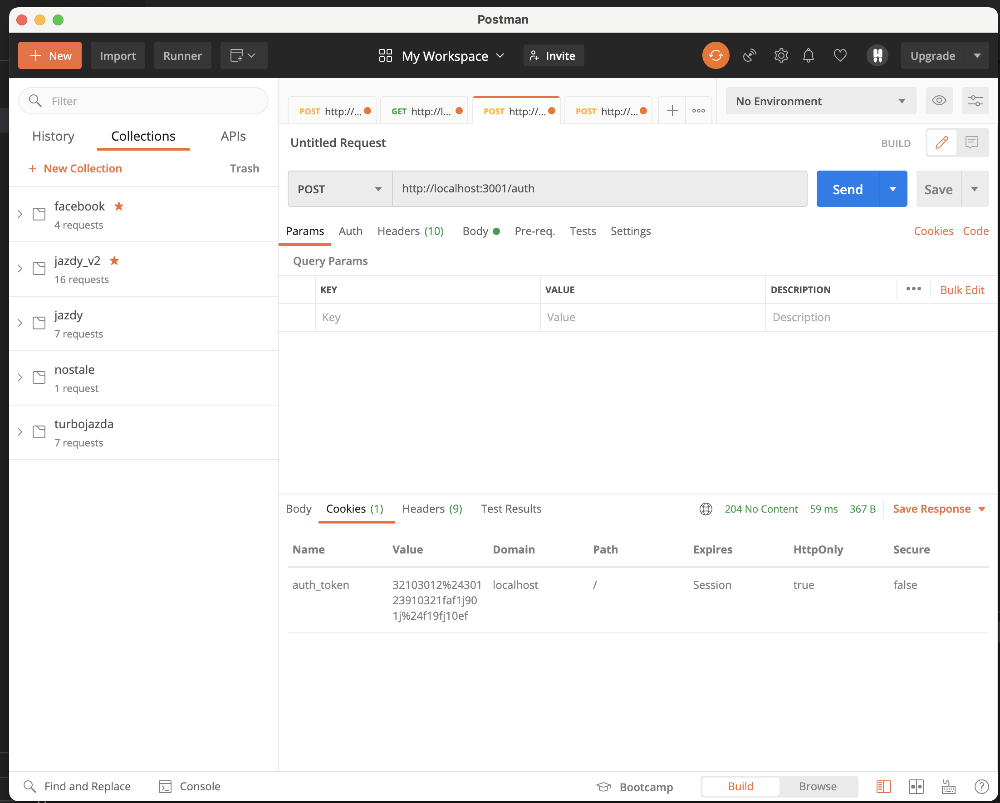

# ai-185ic-21709-lab4

Api służy do zapisywania dowolnych zasobów json w pamięci operacyjnej. Aby zacząć korzystać z api, należy wysłać 
żądanie POST na **/auth**, w treści należy wysłać login oraz hasło. Żądanie zwróci kod 401 w przypadku nieprawidłowych 
danych logowania lub kod 204 (No Content) - oraz ustanowi ciasteczko (w trybie httpOnly) z tokenem uwierzytelniającym. Do każdego kolejnego żądania 
należy dołączyć wspomniane ciasteczko - inaczej żądanie zwróci kod 401 (Unauthorised)  
Ścieżki **/auth** oraz **/keys** są zastrzeżone - na wszystkich innyh można zapisywać dowolne zasoby.

## utworzenie zasobu
Wystarczy wysłać dowolny JSON na dowolną scieżkę metodą POST. Jeśli zasób już istnieje na podanej ścieżce żądanie zwróci kod 403 (Forbidden). Jeśli utworzenie zasobu zakończy się powodzeniem zwrócony zostanie kod 204 (No Content)

## pobranie zasobu
Aby pobrać wybrany zasób wystarczy wysłać żądanie GET na odpowiadającą mu scieżkę. Jeśli zasób istnieje zostanie zwrócony, jeśli nie - zwrócony zostanie kod 404 (Not Found)

## aktualizacja zasobu
Jeśli zasób nie istnieje zwrócony zostanie kod 404 (Not Found).
### kompletne nadpisanie zasobu
Wysyłamy nowy zasób na odpowiednią ścieżkę metodą PUT, stary zasób zostanie podmieniony przez nowy. Jeśli nadpisanie zakończy się powodzeniem
zostanie wysłany kod 204 (No Content)
### cześciowa aktualizacja zasobu
Korzystając z metody PATCH możemy wysłać nowy obiekt - który zostanie płytko złączony z istniejącym zasobem (nowe cechy nadpisują stare). 
Przy powodzeniu zwracany jest nowy obiekt. 
## usunięcie zasobu
Wystarczy wysłać żadanie DELETE na odpowiednią ścieżkę, w przypadku braku zasobu zwrócony zostanie kod 404 (Not Found), gdy zasób istnieje - zostanie usunięty i zwrócony zostanie kod 204 (No Content);
## listowanie zasobów
Aby pobrać listę wszystkich kluczy (adresów URL) - na których zapisane są dowolne zasoby - należy wysłać żądanie GET na ścieżkę **/keys**
Zasoby można dowolnie filtrować - wystarczy do żądania dodać parametr **filter** - jego wartością jest dowolny ciąg znaków reprezentujący wzór [wyrażenienia regularnego](https://www.w3schools.com/jsref/jsref_obj_regexp.asp). Dodatkowo można również dołączyć do żadania parametr **flags** - reprezentujący flagi, które zostaną dołączone do wyrażenia regularnego.

## zrzuty ekranu (aby zobaczyć opis zdjęcia należy najechać na nie myszą)

